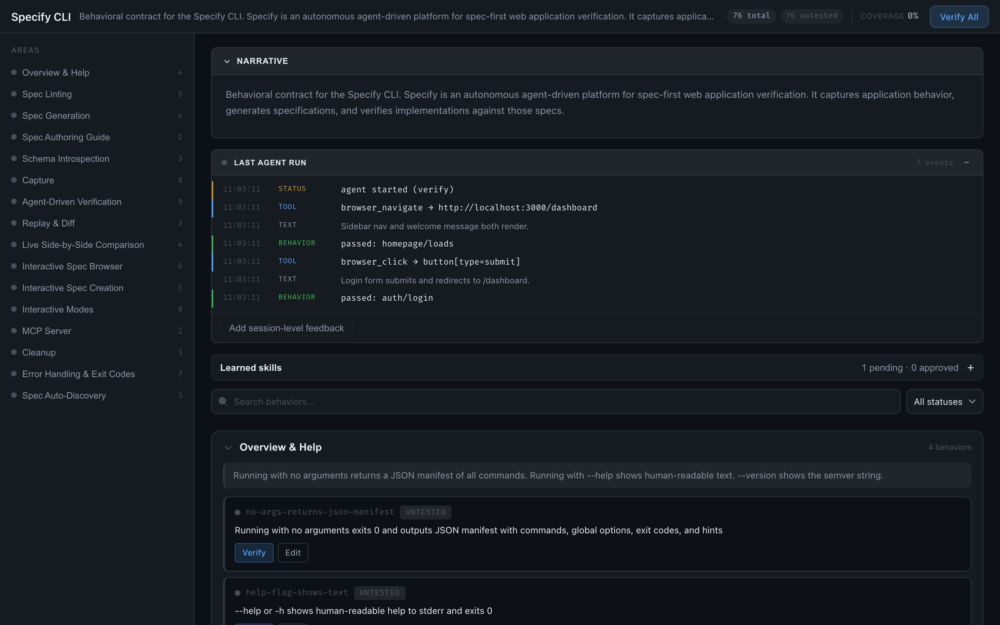
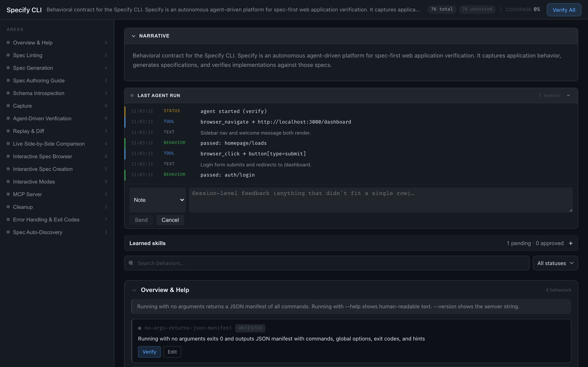
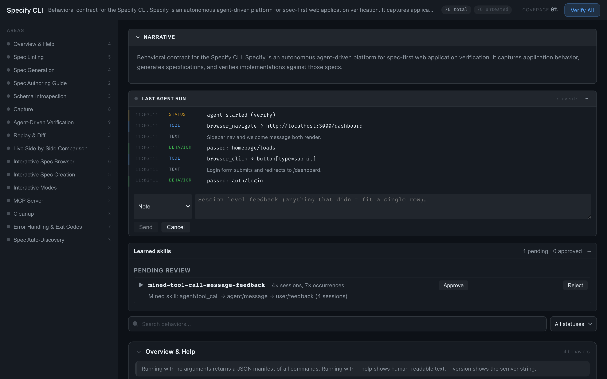

```

   ███████╗██████╗ ███████╗ ██████╗██╗███████╗██╗   ██╗
   ██╔════╝██╔══██╗██╔════╝██╔════╝██║██╔════╝╚██╗ ██╔╝
   ███████╗██████╔╝█████╗  ██║     ██║█████╗   ╚████╔╝
   ╚════██║██╔═══╝ ██╔══╝  ██║     ██║██╔══╝    ╚██╔╝
   ███████║██║     ███████╗╚██████╗██║██║        ██║
   ╚══════╝╚═╝     ╚══════╝ ╚═════╝╚═╝╚═╝        ╚═╝

   Write specs. Validate behavior. Ship with evidence.

```

Specify turns functional requirements into machine-verifiable specs and runs an autonomous agent against them. Define what your app should do — pages, flows, assertions, API contracts — and Specify tells you what's met, what's not, and what's untested. Every assertion shows its work: expected value, actual value, raw output.

Cooperative QA: the agent runs, you watch the activity stream in the browser, flag what looks wrong, and the next run remembers. Per-spec memory, session transcripts, and a confidence model accumulate into mined skills the agent replays automatically.

No opinions about your test framework. No lock-in. Just structured truth.

---

<p align="center">
  
</p>

---

## Install

```bash
npm install
npm run build
(cd webapp && npm install && npm run build)   # builds the review UI into dist/webapp
```

The wrapper script at `./specify` auto-builds on first run.

## Quickstart

```bash
# 1. Generate a contract from existing capture data (or run `specify capture` first)
specify spec generate --input ./captures/my-app --output app.spec.yaml

# 2. Verify the implementation
specify verify --spec app.spec.yaml --url http://localhost:3000

# 3. Review results in the browser — flag what looks wrong, the next run remembers
specify review --spec app.spec.yaml
```

`specify review` opens the webapp shown above. Click any timeline event to flag
it; flags become observations the agent reads as preamble next run.

## Commands

| Command | What |
|---------|------|
| **`spec generate`** | Generate a spec from a capture directory |
| **`capture`** | Agent-driven capture from a live system (`--url`) or code (`--from code`) |
| **`compare`** | Live side-by-side comparison of remote vs local targets |
| **`review`** | Browser UI: narrative, activity stream, feedback, skill drafts |
| **`verify`** | Verify against a live target (`--url`) — emits a structured report |
| `replay` | Replay captured traffic against a target and diff results |
| `impersonate` | Spin up a MockServer container that impersonates the captured system |
| `lint` / `spec lint` | Structural validation (no captures needed) |
| `spec guide` | Authoring guide for LLM spec writers |
| `schema` | Emit JSON Schema for spec, report, or commands |
| `mcp` | MCP server — any LLM client can use Specify as a tool |
| `daemon` | Long-running HTTP inbox; other agents push verify/capture/compare jobs |
| `serve` / `ui` / `ui start` / `ui stop` | Lower-level review-UI controls |
| `human` | Interactive wizard / REPL / TUI dashboard |
| `clean` | Remove generated reports, agent output, and `*.review.html` files |

Run `specify <cmd> --help` for full flags. Source: [`src/cli/commands-manifest.ts`](src/cli/commands-manifest.ts).

## Reports you can trust

Every validation report includes **expected vs actual evidence** for every assertion. No "100% passed, trust me" — you get the raw output, the exact match, and the assertion logic.

Formats: **JSON** (machine), **Markdown** (diff-friendly), **HTML** (interactive, filterable, single file).

```
| Status | Type           | Expected          | Actual                              |
|--------|----------------|-------------------|-------------------------------------|
| ✅     | text_contains  | spec validate     | ..."name": "spec validate", ...     |
| ✅     | json_path      | 0.1.0             | 0.1.0                               |
| ❌     | json_schema    | matches schema    | /items: must have >= 5 items        |
```

## The learning loop

Specify is more than a one-shot verifier. Every run reads, writes, and refines
state under `<spec_dir>/.specify/`:

```
.specify/
  memory/<spec_id>/<target_key>.json   # learned rows: quirks, playbooks, observations
  sessions.db                          # SQLite + FTS5 transcripts of every session
  confidence.json                      # accept/override tally per behavior
  specify.observations.yaml            # per-spec observations (user feedback + reflection)
  skill-drafts/<id>.md                 # mined-pattern → SKILL.md draft, pending review
  skills/<name>/SKILL.md               # approved skills, replayed in future runs
  prompts/<id>.md                      # versioned, evolved system prompts
  verify/verify-result.json            # latest agent run result
```

**Memory rows** ([`src/agent/memory-provider.ts`](src/agent/memory-provider.ts), [`src/agent/memory.ts`](src/agent/memory.ts))
persist across runs, scoped strictly by `(spec_id, target_key)` so staging and
prod never cross-contaminate. The agent injects them into the next prompt as a
preamble; subsequent runs read/update via `memory_record` + `memory_list` MCP
tools.

**Three context layers** ([`src/agent/memory-layers.ts`](src/agent/memory-layers.ts))
are merged into every system prompt: user (`~/.specify/memory.md`), project
(`SPECIFY.md` or `CLAUDE.md`), and per-spec (`specify.observations.yaml`).
Missing layers are silently skipped.

**Sessions store** ([`src/agent/session-store.ts`](src/agent/session-store.ts))
indexes every event in SQLite with FTS5 so the agent (and you) can search prior
runs by content.

**Confidence model** ([`src/agent/confidence-store.ts`](src/agent/confidence-store.ts))
tallies accept vs override per behavior id. The autonomy preset
(`ask_everything` / `ask_uncertain` / `autonomous`) decides whether to ask
before flagging, run silently, or skip.

**Pattern miner → skill drafts**
([`src/agent/pattern-miner.ts`](src/agent/pattern-miner.ts),
[`src/agent/skill-synthesizer.ts`](src/agent/skill-synthesizer.ts))
walks the session corpus, extracts recurring `(role, kind)` n-grams, and emits
draft SKILL.md files. You approve or reject in the webapp; approved drafts
move to `.specify/skills/<name>/SKILL.md` and are injected as a preamble in
future runs.

**Prompt evolution loop**
([`src/agent/prompt-evolution.ts`](src/agent/prompt-evolution.ts))
folds high-confidence observations and frequently-overridden behaviors into a
"lessons learned" preamble. Pure text + deterministic by default; if a Python
script lives at `scripts/evolve-prompt.py`, it's used as an optional
DSPy/GEPA-style optimiser. Evolved prompts are versioned under
`.specify/prompts/`.

**Optional dialectic provider**
([`src/agent/honcho-provider.ts`](src/agent/honcho-provider.ts)) —
when `HONCHO_URL` is set, an external dialectic user-model service is used
instead of the file-backed memory provider. Optional env vars:
`HONCHO_APP` (default `specify`), `HONCHO_USER` (default `$USER`),
`HONCHO_TOKEN`. Without those vars, Specify uses the file-backed provider.

## Cooperative QA via the review webapp

`specify review --spec app.spec.yaml` boots a Hono server with a React UI.
The UI subscribes to a WebSocket of agent events and lets you flag rows inline.

<p align="center">
  
</p>

Each flag is one of: `note`, `important_pattern`, `missed_check`,
`false_positive`, `ignore_pattern`, `file_bug`. Behaviour
([`src/agent/feedback.ts`](src/agent/feedback.ts)):

- writes an observation into `specify.observations.yaml` with `source:
  user_feedback` and the originating session id
- updates the confidence store (`important_pattern` / `file_bug` reinforce;
  `missed_check` / `false_positive` / `ignore_pattern` override)
- on `file_bug`, best-effort spawns `bd create` if available
- on `important_pattern`, publishes a `feedback:ingested` event so the
  sibling-check propagator pre-flags similar rows in the same session

Approved skill drafts surface in a dedicated panel:

<p align="center">
  
</p>

## MCP — use Specify from any LLM

```bash
# Local (stdio)
specify mcp

# Remote (HTTP)
specify mcp --http --port 8080
```

Claude Desktop / Cursor / Claude Code config:
```json
{ "mcpServers": { "specify": { "command": "specify", "args": ["mcp"] } } }
```

Tools exposed include spec authoring helpers and bridge tools for the daemon
(`daemon_verify`, `daemon_submit`, `daemon_status`).

## Daemon — background agent

Run Specify as a long-lived background process. Idle = 0 tokens. Other agents
(or chat bots, webhooks, CI runners) push jobs into an HTTP inbox; each job
spawns an Agent SDK run, streams progress, and writes its structured result
to disk.

```bash
specify daemon --port 4100
# → listens on 127.0.0.1:4100
# → writes a bearer token to ~/.specify/daemon.token on first start
```

Submit a verify job from any agent:

```bash
TOKEN=$(cat ~/.specify/daemon.token)

curl -s -H "Authorization: Bearer $TOKEN" \
     -H 'Content-Type: application/json' \
     -d '{"spec":"/abs/path/spec.yaml","url":"http://localhost:3000"}' \
     http://127.0.0.1:4100/verify
# → {"id":"msg_ab12","status":"queued","stream":"/inbox/msg_ab12/stream"}

# Stream agent events for this message (SSE)
curl -N -H "Authorization: Bearer $TOKEN" \
     http://127.0.0.1:4100/inbox/msg_ab12/stream

# Poll the final result (includes path to on-disk verify-result.json)
curl -s -H "Authorization: Bearer $TOKEN" \
     http://127.0.0.1:4100/inbox/msg_ab12
```

**Endpoints** (all require `Authorization: Bearer <token>` except `/health`):

| Method | Path | Purpose |
|--------|------|---------|
| GET | `/health` | Liveness + active session count |
| POST | `/verify` | `{spec, url}` shorthand |
| POST | `/capture` | `{url}` shorthand |
| POST | `/inbox` | Generic: `{task, prompt, spec?, url?, mode?, session?}` |
| GET | `/inbox` | Recent messages |
| GET | `/inbox/:id` | Status + result + `resultPath` |
| GET | `/inbox/:id/stream` | SSE stream of agent events |
| GET | `/events/stream` | SSE stream of all daemon events |
| GET | `/sessions` | Active persistent sessions |
| POST | `/sessions/:id/close` | Close a persistent session |

**Dispatch modes:**
- `stateless` (default) — fresh SDK run per message, bounded cost.
  Concurrent jobs run in forked worker processes up to `--max-workers`
  (default 2), each with its own Playwright/Chromium.
- `attach` — injects into a persistent SDK session keyed by `session`.
  Holds context across messages; idle still uses 0 tokens. Always
  in-process, serial per session.

**Live inspector:** `GET /` on the daemon serves a zero-build HTML page
that streams agent events, lists recent messages, and shows structured
results. Prompts for the token on first load.

## Spec format

YAML or JSON. Human-readable, machine-verifiable.

```yaml
version: "1.0"
name: "My App"
description: "Behavioral contract for My App"

pages:
  - id: dashboard
    path: /dashboard
    title: "Dashboard"
    visual_assertions:
      - type: element_exists
        selector: "nav.sidebar"
        description: "Navigation sidebar is present"
    expected_requests:
      - method: GET
        url_pattern: "/api/v1/stats"
    scenarios:
      - id: user-login
        description: "User logs in and sees dashboard"
        steps:
          - action: fill
            selector: "#email"
            value: "{{email}}"
          - action: click
            selector: "button[type=submit]"
          - action: wait_for_navigation
            url_pattern: "/dashboard"
          - action: assert_visible
            selector: ".welcome-message"

variables:
  base_url: "${TARGET_BASE_URL}"
```

## Self-verifying

Specify eats its own dogfood. The repo includes [`specify.spec.yaml`](specify.spec.yaml) — a spec for Specify itself — validated on every release.

## License

GPL-3.0
