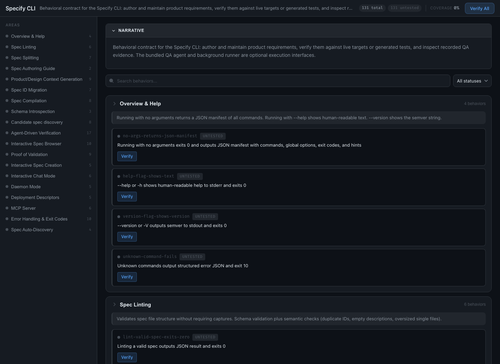
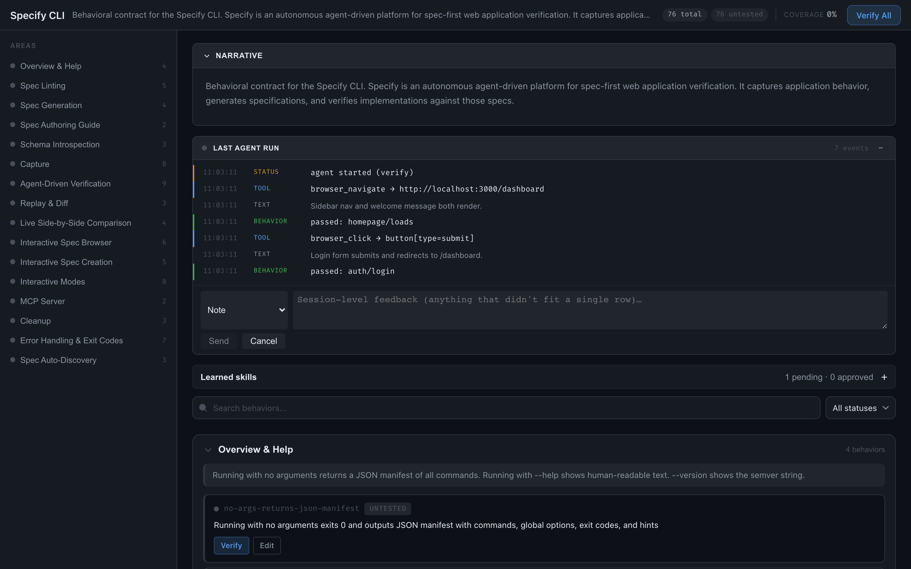
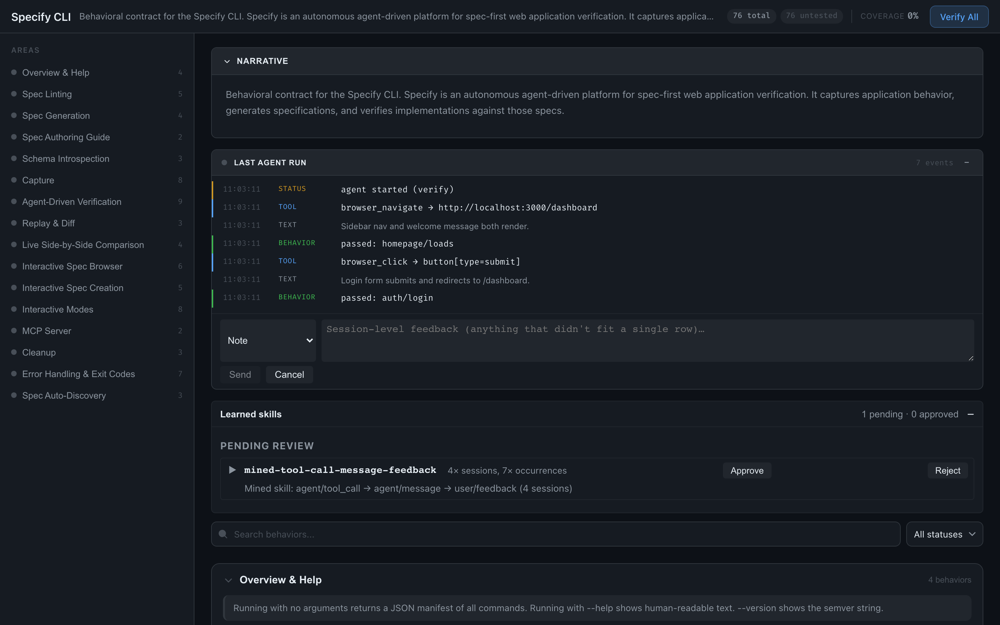

```

   ███████╗██████╗ ███████╗ ██████╗██╗███████╗██╗   ██╗
   ██╔════╝██╔══██╗██╔════╝██╔════╝██║██╔════╝╚██╗ ██╔╝
   ███████╗██████╔╝█████╗  ██║     ██║█████╗   ╚████╔╝
   ╚════██║██╔═══╝ ██╔══╝  ██║     ██║██╔══╝    ╚██╔╝
   ███████║██║     ███████╗╚██████╗██║██║        ██║
   ╚══════╝╚═╝     ╚══════╝ ╚═════╝╚═╝╚═╝        ╚═╝

   Write specs. Validate behavior. Ship with evidence.

```

Specify turns functional requirements into machine-verifiable specs and runs an autonomous agent against them. Define what your app should do — pages, flows, assertions, API contracts — and Specify tells you what's met, what's not, and what's untested. Every assertion shows its work: expected value, actual value, raw output.

Cooperative QA: the agent runs, you watch the activity stream in the browser, flag what looks wrong, and the next run remembers. Per-spec memory, session transcripts, and a confidence model accumulate into optional learned skills when explicitly enabled.

No opinions about your test framework. No lock-in. Just structured truth.

---

<p align="center">
  
</p>

---

## Install

```bash
npm install
npm run build
(cd webapp && npm install && npm run build)   # builds the review UI into dist/webapp
```

The wrapper script at `./specify` auto-builds on first run.

## Quality Gates

```bash
npm run typecheck         # TypeScript for CLI, daemon, agent, and scripts
npm run typecheck:webapp  # TypeScript for the React review UI
npm run lint              # ESLint with TypeScript, SonarJS, security, Unicorn, and React rules
npm run format            # Prettier check
npm run quality           # Typecheck + lint
```

Local SonarQube/SonarCloud scanning is configured with
`sonar-project.properties`. Start or point at a SonarQube server, ensure a Java
runtime is installed for `sonar-scanner`, set `SONAR_TOKEN` when required, and
run:

```bash
npm run sonar -- -Dsonar.host.url=http://localhost:9000
```

## Quickstart

```bash
# 1. Capture the app with an autonomous agent — it explores and writes a spec directly
specify capture --url http://localhost:3000 --spec-output app.spec.yaml

# 2. Verify the implementation
specify verify --spec app.spec.yaml --url http://localhost:3000

# 3. Review results in the browser — flag what looks wrong, the next run remembers
specify review --spec app.spec.yaml
```

`specify review` opens the webapp shown above. Click any timeline event to flag
it; flags become observations the agent reads as preamble next run.

## Large Specs

For larger products, `--spec` may point at a directory instead of one YAML file.
Specify composes the directory into one logical behavioral contract before
linting, review, verify, daemon runs, and agent memory:

```text
spec/
  spec.yaml
  areas/
    auth.yaml
    billing.yaml
```

`spec/spec.yaml` holds top-level metadata and may declare area order:

```yaml
version: "2"
name: "My App"
target:
  type: web
  url: "http://localhost:3000"
areas:
  - areas/auth.yaml
  - areas/billing.yaml
```

Each area file contains one normal area object:

```yaml
id: auth
name: Authentication
behaviors:
  - id: login-valid-credentials
    description: A user with valid credentials can log in and sees the dashboard
```

When `areas` is omitted from the manifest, `areas/**/*.yaml`, `areas/**/*.yml`,
and `areas/**/*.json` are composed in sorted path order. Existing commands keep
the same one-value form:

```bash
specify spec lint --spec spec/
specify verify --spec spec/ --url http://localhost:3000
specify review --spec spec/
```

`specify spec lint` warns when a single YAML/JSON spec starts getting unwieldy
(more than about 40 KiB, 800 lines, 12 areas, or 120 behaviors). Split it
mechanically with:

```bash
specify spec split --spec spec.yaml --output spec/
```

The split command writes `spec/spec.yaml` plus one file per area under
`spec/areas/`. Directory specs do not trigger the single-file size warning.

`specify spec context` regenerates `PRODUCT.md` and `DESIGN.md` straight from
the composed spec — a deterministic projection, no LLM call, so the spec's own
area prose and behavior descriptions ARE the content:

```bash
specify spec context
specify spec context --spec spec/ --out-dir docs --json
```

Every claim carries an inline `[area/behavior]` traceability anchor back to
its source, e.g. `[capture/capture-agent-generates-spec]`. `DESIGN.md` keeps
two sources separate and clearly labeled: spec-derived "Product Constraints"
(behaviors tagged `design`, `ui`, `ux`, `visual`, `accessibility`, `a11y`,
`style`, `layout`, `branding`, or `theme`) and an optional "Visual Tokens"
pass that extracts real values from code (`tokens.json`/`design-tokens.json`,
CSS custom properties) — never invented ones. An area with no prose, a spec
with no design-tagged behaviors, or a codebase with no token sources yields an
omitted or explicitly-empty section, not fabricated text.

Regeneration is non-destructive: generated content lives inside
`<!-- specify:begin:product-context -->` / `<!-- specify:end:... -->` marker
pairs, and only that region is replaced on each run — anything you write
outside the markers survives every regeneration. If a target file already
exists but has no markers (hand-authored before this feature, or edited such
that they were removed), Specify refuses to touch it and writes a reviewable
`PRODUCT.proposed.md` / `DESIGN.proposed.md` alongside it instead; pass
`--force` to overwrite in place anyway.

## Commands

| Command | What |
|---------|------|
| **`create`** | Interactive interview that writes a starter spec (`--narrative` for a companion doc) |
| **`capture`** | Agent-driven capture from a live system (`--url`) — writes a spec directly |
| **`review`** | Browser UI: narrative, activity stream, feedback, skill drafts |
| **`verify`** | Verify against a live target (`--url`) — emits a structured report |
| `spec lint` | Structural validation (no captures needed) |
| `spec guide` | Authoring guide for LLM spec writers |
| `spec context` | Regenerate `PRODUCT.md`/`DESIGN.md` from the spec, non-destructively |
| `schema` | Emit JSON Schema for spec or commands |
| `mcp` | MCP server — any LLM client can use Specify as a tool |
| `daemon` | Long-running HTTP inbox; other agents push verify/capture/compare jobs |
| `review --background` / `review --stop` | Daemonize or stop the review webapp |
| `human` | Interactive chat REPL |

Run `specify <cmd> --help` for full flags. Source: [`src/cli/commands-manifest.ts`](src/cli/commands-manifest.ts).

## Reports you can trust

Every validation report includes **expected vs actual evidence** for every assertion. No "100% passed, trust me" — you get the raw output, the exact match, and the assertion logic.

Formats: **JSON** (machine), **Markdown** (diff-friendly), **HTML** (interactive, filterable, single file).

```
| Status | Type           | Expected          | Actual                              |
|--------|----------------|-------------------|-------------------------------------|
| ✅     | text_contains  | spec validate     | ..."name": "spec validate", ...     |
| ✅     | json_path      | 0.1.0             | 0.1.0                               |
| ❌     | json_schema    | matches schema    | /items: must have >= 5 items        |
```

## The learning loop

Specify is more than a one-shot verifier. Every run reads, writes, and refines
state under `<spec_dir>/.specify/`:

```
.specify/
  memory/<spec_id>/<target_key>.json   # learned rows: quirks, playbooks, observations
  sessions.db                          # SQLite + FTS5 transcripts of every session
  confidence.json                      # accept/override tally per behavior
  specify.observations.yaml            # per-spec observations (user feedback + reflection)
  skill-drafts/<id>.md                 # optional learned-skill drafts
  skills/<name>/SKILL.md               # approved skills, replayed when enabled
  verify/verify-result.json            # latest agent run result
```

**Memory rows** ([`src/agent/memory-provider.ts`](src/agent/memory-provider.ts), [`src/agent/memory.ts`](src/agent/memory.ts))
persist across runs, scoped strictly by `(spec_id, target_key)` so staging and
prod never cross-contaminate. The agent injects them into the next prompt as a
preamble; subsequent runs read/update via `memory_record` + `memory_list` MCP
tools.

**Three context layers** ([`src/agent/memory-layers.ts`](src/agent/memory-layers.ts))
are merged into every system prompt: user (`~/.specify/memory.md`), project
(`SPECIFY.md` or `CLAUDE.md`), and per-spec (`specify.observations.yaml`).
Missing layers are silently skipped.

**Sessions store** ([`src/agent/session-store.ts`](src/agent/session-store.ts))
indexes every event in SQLite with FTS5 so the agent (and you) can search prior
runs by content.

**Confidence model** ([`src/agent/confidence-store.ts`](src/agent/confidence-store.ts))
tallies accept vs override per behavior id. The autonomy preset
(`ask_everything` / `ask_uncertain` / `autonomous`) decides whether to ask
before flagging, run silently, or skip.

**Pattern miner → skill drafts**
([`src/agent/pattern-miner.ts`](src/agent/pattern-miner.ts),
[`src/agent/skill-synthesizer.ts`](src/agent/skill-synthesizer.ts))
is experimental and disabled by default. Set
`SPECIFY_ENABLE_LEARNED_SKILLS=true` to expose draft review endpoints and inject
approved `.specify/skills/<name>/SKILL.md` entries into future runs.

**Optional dialectic provider**
([`src/agent/honcho-provider.ts`](src/agent/honcho-provider.ts)) —
when `HONCHO_URL` is set, an external dialectic user-model service is used
instead of the file-backed memory provider. Optional env vars:
`HONCHO_APP` (default `specify`), `HONCHO_USER` (default `$USER`),
`HONCHO_TOKEN`. Without those vars, Specify uses the file-backed provider.

## Cooperative QA via the review webapp

`specify review --spec app.spec.yaml` boots a Hono server with a React UI.
The UI subscribes to a WebSocket of agent events and lets you flag rows inline.

<p align="center">
  
</p>

Each flag is one of: `note`, `important_pattern`, `missed_check`,
`false_positive`, `ignore_pattern`, `file_bug`. Behaviour
([`src/agent/feedback.ts`](src/agent/feedback.ts)):

- writes an observation into `specify.observations.yaml` with `source:
  user_feedback` and the originating session id
- updates the confidence store (`important_pattern` / `file_bug` reinforce;
  `missed_check` / `false_positive` / `ignore_pattern` override)
- on `file_bug`, best-effort spawns `bd create` if available
- when `SPECIFY_ENABLE_LEARNED_SKILLS=true`, `important_pattern` feedback can
  prompt the active agent to apply the same check to sibling behaviors

When `SPECIFY_ENABLE_LEARNED_SKILLS=true`, approved skill drafts surface in a
dedicated panel:

<p align="center">
  
</p>

## MCP — use Specify from any LLM

```bash
# Local (stdio)
specify mcp

# Remote (HTTP)
specify mcp --http --port 8080
```

Claude Desktop / Cursor / Claude Code config:
```json
{ "mcpServers": { "specify": { "command": "specify", "args": ["mcp"] } } }
```

Tools exposed include spec authoring helpers and bridge tools for the daemon
(`daemon_verify`, `daemon_submit`, `daemon_status`).

## Daemon — background agent

Run Specify as a long-lived background process. Idle = 0 tokens. Other agents
(or chat bots, webhooks, CI runners) push jobs into an HTTP inbox; each job
spawns an Agent SDK run, streams progress, and writes its structured result
to disk.

```bash
specify daemon --port 4100
# → listens on 127.0.0.1:4100
# → writes a bearer token to ~/.specify/daemon.token on first start
```

Submit a verify job from any agent:

```bash
TOKEN=$(cat ~/.specify/daemon.token)

curl -s -H "Authorization: Bearer $TOKEN" \
     -H 'Content-Type: application/json' \
     -d '{"task":"verify","prompt":"Verify http://localhost:3000 against the spec.","spec":"/abs/path/spec.yaml","url":"http://localhost:3000"}' \
     http://127.0.0.1:4100/inbox
# → {"id":"msg_ab12","status":"queued","stream":"/inbox/msg_ab12/stream"}

# Stream agent events for this message (SSE)
curl -N -H "Authorization: Bearer $TOKEN" \
     http://127.0.0.1:4100/inbox/msg_ab12/stream

# Poll the final result (includes path to on-disk verify-result.json)
curl -s -H "Authorization: Bearer $TOKEN" \
     http://127.0.0.1:4100/inbox/msg_ab12
```

**Endpoints** (all require `Authorization: Bearer <token>` except `/health`):

| Method | Path | Purpose |
|--------|------|---------|
| GET | `/health` | Liveness + active session count |
| POST | `/inbox` | Generic: `{task, prompt, spec?, url?, mode?, session?}` |
| GET | `/inbox` | Recent messages |
| GET | `/inbox/:id` | Status + result + `resultPath` |
| GET | `/inbox/:id/stream` | SSE stream of agent events |
| GET | `/events/stream` | SSE stream of all daemon events |
| GET | `/sessions` | Active persistent sessions |
| POST | `/sessions/:id/close` | Close a persistent session |

**Dispatch modes:**
- `stateless` (default) — fresh SDK run per message, bounded cost.
  Concurrent jobs run in forked worker processes up to `--max-workers`
  (default 2), each with its own Playwright/Chromium.
- `attach` — injects into a persistent SDK session keyed by `session`.
  Holds context across messages; idle still uses 0 tokens. Always
  in-process, serial per session.

**Live inspector:** `GET /` on the daemon serves a zero-build HTML page
that streams agent events, lists recent messages, and shows structured
results. Prompts for the token on first load.

## Deploy as a QA agent in Kubernetes

Specify ships a container image and a Terraform module so it can run as a
long-lived QA agent inside a cluster. One pod per spec, PVC-backed memory
that survives restarts, and pluggable triggers (k8s informer, webhook, or
both).

```hcl
module "qa" {
  source = "github.com/gm2211/specify//deploy/terraform/modules/specify-qa?ref=main"

  name      = "renzo-qa"
  namespace = "qa"

  target_url  = "http://renzo.app.svc.cluster.local:8080"
  spec_inline = file("${path.module}/specify.spec.yaml")

  discovery = { mode = "watch", namespaces = ["app"] }

  report_slack_webhook     = var.slack_webhook_url
  anthropic_api_key_secret = "anthropic-api-key"
}
```

| Group | Pick exactly one |
|-------|------------------|
| Target | `target_url` · `target_dns` · `target_cluster_ip` · `target_from_configmap` |
| Spec | `spec_inline` · `spec_url` (+ optional bearer) · `spec_git` |
| Discovery | `webhook` (default) · `watch` · `both` · `none` |
| Reports | `report_file_dir` (default) + optional `report_slack_webhook` |

**Self-describing install for agents.** `specify deploy describe --format=json`
emits a structured manifest: image coordinates, module ref, oneof groups,
required Secrets, outputs, and an `agent_install_recipe`. Drop `specify
deploy print-tf <preset>` into a consumer repo for a working `.tf`
skeleton (`minimal`, `watch-mode`, `webhook-mode`, `gitops-spec`).

```bash
specify deploy describe --format=json | jq .
specify deploy print-tf watch-mode > specify-qa.tf
```

**Worked examples** live in [`deploy/terraform/examples/`](deploy/terraform/examples):
[`minimal`](deploy/terraform/examples/minimal),
[`watch-mode`](deploy/terraform/examples/watch-mode),
[`gitops-spec`](deploy/terraform/examples/gitops-spec). Each example is a
runnable `terraform apply` directory with a per-example README.

The pod's `/work` PVC keeps everything the daemon learns:

| Path | Content |
|------|---------|
| `/work/.specify/memory/<spec_id>/<target>.json` | learned memory rows |
| `/work/.specify/sessions.db` | session SQLite + FTS5 |
| `/work/.specify/skill-drafts/` | optional learned-skill drafts |
| `/work/.specify/skills/` | active skills replayed when `SPECIFY_ENABLE_LEARNED_SKILLS=true` |
| `/work/reports/` | per-run JSON reports (file sink) |

See [`deploy/terraform/modules/specify-qa/README.md`](deploy/terraform/modules/specify-qa/README.md)
for the full input / output reference.

## Spec format

YAML or JSON, both parse the same way. Specs are v2 behavioral contracts:
areas group behaviors, and each behavior is a plain-language claim about what
should be true. There are no selectors, no matchers, no step sequences — the
agent decides how to verify each claim.

```yaml
version: "2"
name: "My App"
description: "Behavioral contract for My App"

target:
  type: web
  url: "http://localhost:3000"

variables:
  admin_email: "admin@example.com"

areas:
  - id: dashboard
    name: "Dashboard"
    prose: >
      The dashboard is the default landing page after login and summarizes
      account activity.
    behaviors:
      - id: shows-nav-sidebar
        description: >
          The dashboard renders a navigation sidebar linking to every major
          section of the app
        tags: [ui, navigation]

  - id: auth
    name: "Authentication"
    behaviors:
      - id: valid-login-redirects
        description: >
          A user who logs in with {{admin_email}} and a valid password is
          redirected to /dashboard and sees a welcome message
        details: "Applies to both password and SSO login flows."
```

Full schema: `specify schema spec` (or see [`src/spec/schema.ts`](src/spec/schema.ts)). The repo's own [`specify.spec/`](specify.spec/spec.yaml) is a complete real-world example, split into a directory spec via `specify spec split`.

## Self-verifying

Specify eats its own dogfood. The repo includes [`specify.spec/`](specify.spec/spec.yaml) — a spec for Specify itself — validated on every release.

## License

GPL-3.0
