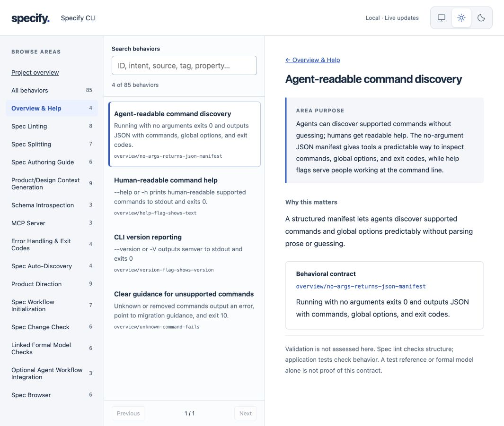
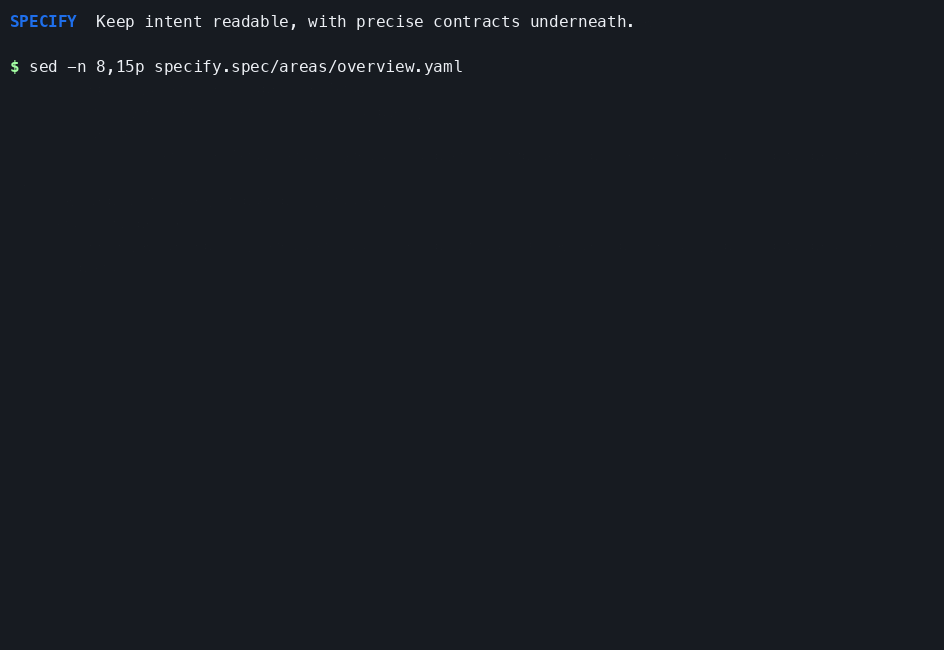

# Specify

Keep product intent in one small, versioned behavioral spec. Stable behavior IDs make decisions
reviewable as code changes; source quotes keep user direction attached to the behavior it governs.

Read the big picture, understand why each rule matters, then inspect its exact contract. The bundled
reader works with your existing YAML, JSON, or directory spec.

<picture>
  <source media="(prefers-color-scheme: dark)" srcset="docs/media/reader-dark.jpg">
  
</picture>

[Light theme](docs/media/reader-light.jpg) · [Dark theme](docs/media/reader-dark.jpg)

## Quick start

From a source checkout:

```bash
npm ci
npm run build
./specify spec init --spec specify.spec
./specify view
./specify spec check --spec specify.spec --base "$BASE"
```

`spec init` adds concise managed instructions to `AGENTS.md`. `spec check` lints the selected spec
and requires a spec change or an explicit reason when repository files change without one. See
[workflow](docs/workflow.md) and [0.4 migration notes](docs/migration-0.4.md).

## Watch the workflow

Real CLI output: inspect a contract, install agent guidance, lint the spec, and start the reader.
Lint validates structure; your application test suite validates behavior.



[Replay the asciinema recording](docs/media/demo.cast) ·
[Recording steps and text walkthrough](docs/media/README.md)

## Browse your spec

Run `specify view` from any project to open its spec in your browser (or `./specify view` from this
checkout). The viewer ships with Specify: no separate app, frontend installation, or format
conversion. It discovers YAML, JSON, and directory specs using the same rules as the other commands.
Use `--spec path/to/project.spec` to select a source when discovery is ambiguous.

Browse areas, search intent and stable behavior IDs, inspect original user quotes and formal links,
and page through large result sets. Source changes appear automatically. Invalid edits keep the last
readable spec visible with an out-of-date notice until they are fixed. Formal references are not
proof results. The viewer reads specs without running hooks, tests, or models.

The server binds to `127.0.0.1` on an available port and prints its URL. Use `--no-open` to open it
manually or `--port 4310` for a fixed port. Keep the command running while browsing; Ctrl-C stops
it.

Choose System, Light, or Dark in the reader. Explicit choices are remembered for that viewer address
when browser storage is available. Project and area overviews explain purpose before individual
contracts. Optional behavior `title` fields provide short labels; `rationale` explains why a rule
matters. Keep `description` as the precise promise and `details` for edge cases. Existing specs
remain compatible, and generated product context includes the new fields.

## Keep intent connected to implementation

Validate contracts with your normal application test suite, referencing stable behavior IDs in test
names. Record actual commands, results, and the tested revision in the existing PR or task tracker.
The viewer does not calculate coverage: structural lint validates spec shape, and linked formal
checks validate authored models. Neither replaces tests of the implementation.

Use `spec guide` to author a v2 YAML or JSON contract. `spec lint`, `spec split`, `spec context`,
`formal check`, `schema`, and local stdio MCP tools support authoring and bounded checks of
explicitly linked formal models. Formal checks report properties of those models, not semantic
agreement with the prose or correctness of the application. See [formal checks](docs/formal.md) for
tool setup, examples, and limits. Specify does not run application tests or manage a separate intent
ledger.

Agents use the guide's capture → review → reconcile protocol to record conversational decisions,
surface conflicts before implementation, and check behavior IDs against current code and actual test
evidence. [Spec Kit adapter](docs/spec-kit.md) exposes the same workflow as optional agent commands
while retaining the existing spec as the only requirements source.
